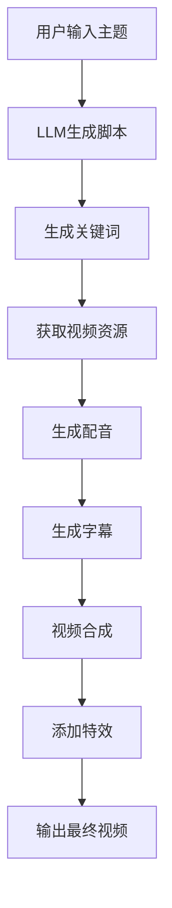
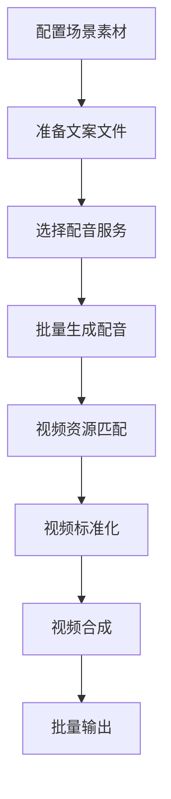
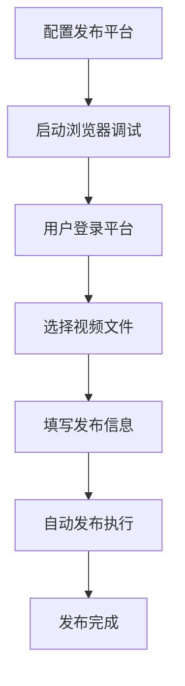

# MincodeVideos 项目详细文档

## 项目概述

MincodeVideos 是一个基于AI技术的全栈短视频生成和发布工具。该项目旨在帮助用户快速生成高质量的短视频内容，并支持批量自动发布到各大视频平台。

### 主要特性
- 🤖 **AI视频生成**: 使用大语言模型自动生成视频脚本和内容
- 🎬 **视频混剪**: 支持批量视频混剪，快速生成大量不重复的短视频
- 📢 **自动发布**: 支持一键发布到抖音、快手、小红书、视频号等平台
- 🎵 **多语音支持**: 集成Azure、阿里云、腾讯云等语音服务，支持本地TTS模型
- 🌐 **多语言界面**: 支持中文、英文等多语言界面
- 🔧 **模块化设计**: 高度模块化的架构，便于扩展和维护

## 项目架构与设计方案

### 整体架构

```
MincodeVideos/
├── config/              # 配置文件管理
├── pages/               # Streamlit页面组件
├── services/            # 业务服务层
│   ├── audio/          # 音频处理服务
│   ├── captioning/     # 字幕生成服务
│   ├── hunjian/        # 视频混剪服务
│   ├── llm/           # 大语言模型服务
│   ├── publisher/      # 视频发布服务
│   ├── resource/       # 资源获取服务
│   ├── sd/            # Stable Diffusion服务
│   └── video/         # 视频处理服务
├── tools/              # 工具类库
├── work/               # 工作目录
├── final/              # 输出目录
└── 主入口文件
```

### 设计模式

1. **MVC模式**: 采用Model-View-Controller模式
   - Model: 服务层(services/)处理业务逻辑
   - View: Streamlit页面(pages/)提供用户界面
   - Controller: 主程序(main.py)协调各组件

2. **工厂模式**: LLM服务使用工厂模式创建不同提供商的服务实例

3. **策略模式**: 音频服务支持多种TTS提供商，通过配置动态选择

4. **模板方法模式**: 视频生成流程定义模板，各服务实现具体步骤

### 核心设计原则

- **模块化**: 每个功能模块相对独立，便于维护和扩展
- **配置化**: 大量配置项通过YAML文件管理
- **插件化**: 支持动态加载不同的AI模型和服务
- **容错性**: 完善的异常处理和日志记录机制

## 核心业务流程

### 1. AI视频生成流程



### 2. 视频混剪流程



### 3. 自动发布流程



## 主要功能模块详解

### 1. LLM服务模块 (`services/llm/`)

**核心功能**: 集成多种大语言模型提供商

**支持的模型**:
- OpenAI GPT系列
- Azure OpenAI
- Moonshot
- 百度千帆
- 百度文心一言
- 阿里通义千问
- DeepSeek
- Ollama (本地部署)

**设计模式**: 抽象工厂模式 + 策略模式

```python
# 服务创建工厂
def get_llm_provider(provider_name):
    providers = {
        'openai': MyOpenAIService(),
        'azure': MyAzureService(),
        'moonshot': MyMoonshotService(),
        # ... 其他提供商
    }
    return providers.get(provider_name)
```

### 2. 音频服务模块 (`services/audio/`)

**核心功能**: 语音合成和语音识别

**支持的服务**:
- **云端TTS**: Azure, 阿里云, 腾讯云
- **本地TTS**: ChatTTS, GPT-SoVITS, CosyVoice
- **语音识别**: FasterWhisper, SenseVoice

**架构特点**:
- 统一的接口设计
- 动态配置加载
- 支持音频试听功能

### 3. 视频服务模块 (`services/video/`)

**核心功能**: 视频处理和合成

**主要组件**:
- `VideoService`: 核心视频处理服务
- `VideoMixService`: 视频混剪服务
- `VideoMergeService`: 视频合并服务
- `texiao_service`: 视频特效处理

**技术实现**:
- 使用FFmpeg进行视频处理
- 支持多种视频格式转换
- 实现视频标准化和特效添加

### 4. 资源服务模块 (`services/resource/`)

**核心功能**: 获取视频和图片资源

**支持的平台**:
- Pexels: 免费图片视频素材库
- Pixabay: 免费图片视频素材库
- Stable Diffusion: AI图像生成

### 5. 发布服务模块 (`services/publisher/`)

**核心功能**: 自动发布视频到各大平台

**支持平台**:
- 抖音 (Douyin)
- 快手 (Kuaishou)
- 小红书 (Xiaohongshu)
- 视频号 (Shipinhao)
- Bilibili

**技术实现**:
- 基于Selenium的自动化操作
- 支持Chrome和Firefox浏览器
- 实现页面元素定位和模拟点击

## 技术栈

### 后端技术栈
- **Python 3.10+**: 主编程语言
- **Streamlit**: Web界面框架
- **FFmpeg**: 视频音频处理
- **OpenAI API**: 大语言模型接口
- **Azure Cognitive Services**: 语音服务
- **Selenium**: 自动化测试框架

### 依赖管理
主要依赖包详见 `requirements.txt`:

```txt
langchain==0.1.20              # LLM框架
streamlit==1.34.0              # Web界面
torch==2.3.1                   # PyTorch深度学习框架
faster-whisper==1.0.3          # 本地语音识别
selenium==4.20.0               # 自动化操作
azure-cognitiveservices-speech==1.36.0  # Azure语音服务
```

## 环境搭建和运行指南

### 环境要求

#### 基础环境
- **操作系统**: Windows 10+ / macOS 12+ / Ubuntu 18.04+
- **Python**: 3.10 或 3.11
- **内存**: 至少8GB RAM
- **存储**: 至少10GB可用空间

#### 必需工具
- **FFmpeg**: 视频音频处理工具
- **Git**: 版本控制工具

### 安装步骤

#### 1. 克隆项目
```bash
git clone https://github.com/ddean2009/MoneyPrinterPlus.git  # 原作者仓库
cd MincodeVideos  # 或者使用您自己的项目目录名
```

#### 2. 安装Python依赖
```bash
# 方式1: 手动安装
pip install -r requirements.txt

# 方式2: 自动安装 (推荐)
# Windows
setup.bat
# macOS/Linux
bash setup.sh
```

#### 3. 配置环境变量

**FFmpeg安装**:
```bash
# Windows: 下载并解压到任意目录，将bin目录添加到PATH
# macOS: brew install ffmpeg
# Ubuntu: sudo apt install ffmpeg
```

**浏览器配置**:
- Chrome浏览器版本需与ChromeDriver匹配
- Firefox浏览器版本需与geckodriver匹配

### 运行项目

#### 开发模式运行
```bash
streamlit run gui.py
```

#### 生产模式运行
```bash
# Windows
start.bat
# macOS/Linux
bash start.sh
```

## 编译、调试、测试验证方法

### 调试方法

#### 1. 本地调试
```bash
# 启用调试模式
export STREAMLIT_DEBUG=true
streamlit run gui.py --logger.level=debug
```

#### 2. 日志查看
```bash
# 查看应用日志
tail -f ~/.streamlit/logs/streamlit.log

# 查看FFmpeg执行日志
ffmpeg -loglevel debug [命令]
```

#### 3. 浏览器开发者工具
- 打开浏览器DevTools (F12)
- 查看Network面板监控API调用
- 查看Console面板查看JavaScript错误

### 测试验证

#### 1. 单元测试
```bash
# 运行基础功能测试
python -m pytest tests/ -v

# 测试LLM服务
python -c "from services.llm.llm_service import *; # 测试代码"

# 测试音频服务
python main.py  # 执行main_try_test_audio()
```

#### 2. 功能测试

**视频生成测试**:
1. 启动应用界面
2. 进入"自动短视频生成器"页面
3. 输入测试主题: "人工智能的发展"
4. 依次执行: 生成内容 → 获取资源 → 生成配音 → 生成视频
5. 验证输出目录是否有视频文件生成

**混剪功能测试**:
1. 进入"视频批量混剪工具"页面
2. 配置素材目录和文案文件
3. 执行批量生成
4. 检查输出视频质量和数量

**发布功能测试**:
1. 配置浏览器调试模式
2. 进入"批量短视频上传工具"页面
3. 执行环境检测
4. 测试单个视频发布

#### 3. 性能测试

**内存使用监控**:
```bash
# 使用psutil监控内存
python -c "
import psutil
import os
process = psutil.Process(os.getpid())
print(f'内存使用: {process.memory_info().rss / 1024 / 1024:.2f} MB')
"
```

**视频生成耗时统计**:
```python
import time
start_time = time.time()
# 执行视频生成流程
end_time = time.time()
print(f"生成耗时: {end_time - start_time:.2f} 秒")
```

### 常见问题排查

#### 1. FFmpeg相关问题
```bash
# 检查FFmpeg安装
ffmpeg -version

# 测试视频处理
ffmpeg -i input.mp4 -vf scale=720:1280 output.mp4
```

#### 2. API配置问题
```bash
# 测试OpenAI API连接
python -c "
import openai
openai.api_key = 'your-api-key'
response = openai.ChatCompletion.create(
    model='gpt-3.5-turbo',
    messages=[{'role': 'user', 'content': 'Hello'}]
)
print(response)
"
```

#### 3. 浏览器自动化问题
```bash
# 检查ChromeDriver版本匹配
chromedriver --version
google-chrome --version

# 测试Selenium连接
python -c "
from selenium import webdriver
driver = webdriver.Chrome()
driver.get('https://www.baidu.com')
print('浏览器启动成功')
driver.quit()
"
```

## 配置说明

### 配置文件结构

```yaml
# config.yml
ui:
  language: "zh-CN"

llm:
  provider: "openai"
  openai:
    api_key: "your-api-key"
    base_url: "https://api.openai.com/v1"
    model_name: "gpt-3.5-turbo"

audio:
  provider: "azure"
  azure:
    speech_key: "your-speech-key"
    service_region: "eastus"
  local_tts:
    provider: "chatTTS"
    chatTTS:
      server_location: "http://localhost:8080"

resource:
  provider: "pexels"
  pexels:
    api_key: "your-pexels-key"

publisher:
  driver_location: "/path/to/chromedriver"
  content_location: "/path/to/videos"
  auto_publish: true
```

### 配置项说明

#### LLM配置
- **provider**: 选择使用的LLM提供商
- **api_key**: API密钥
- **base_url**: API基础URL (可选)
- **model_name**: 模型名称

#### 音频配置
- **provider**: 语音服务提供商 (azure/ali/tencent)
- **speech_key**: 语音服务密钥
- **service_region**: 服务区域
- **local_tts**: 本地TTS配置

#### 资源配置
- **provider**: 资源提供商 (pexels/pixabay)
- **api_key**: 资源API密钥

#### 发布配置
- **driver_location**: 浏览器驱动路径
- **content_location**: 视频内容目录
- **auto_publish**: 是否自动发布

## 使用教程

### 快速开始

#### 1. 基础配置
1. 启动应用: `streamlit run gui.py`
2. 进入"基本配置信息"页面
3. 配置LLM服务 (推荐使用Moonshot)
4. 配置语音服务 (推荐使用Azure)
5. 配置资源服务 (推荐使用Pexels)

#### 2. 生成第一个视频
1. 进入"自动短视频生成器"
2. 输入主题: "介绍人工智能的发展历程"
3. 选择视频语言: 中文
4. 设置视频时长: 120字以内
5. 点击"生成视频内容"
6. 依次执行后续步骤
7. 等待视频生成完成

#### 3. 批量混剪视频
1. 准备素材目录和文案文件
2. 进入"视频批量混剪工具"
3. 配置场景资源路径
4. 设置配音和视频参数
5. 执行批量生成

#### 4. 自动发布视频
1. 配置浏览器调试模式
2. 进入"批量短视频上传工具"
3. 选择目标平台
4. 配置发布参数
5. 执行环境检测
6. 开始自动发布

### 高级用法

#### 自定义语音模型
1. 配置本地TTS服务 (ChatTTS/GPT-SoVITS/CosyVoice)
2. 设置服务器地址和参数
3. 测试语音生成效果

#### 视频特效配置
1. 选择转场效果类型
2. 调整视频参数 (分辨率、帧率、时长)
3. 配置字幕样式和位置

#### 多平台发布策略
1. 配置多个平台的发布参数
2. 设置发布时间间隔
3. 批量选择目标平台

## 开发指南

### 项目结构规范

#### 目录结构
```
services/[模块名]/
├── __init__.py
├── [模块]_service.py      # 主要服务类
├── [子模块]_service.py    # 子服务类
└── README.md             # 模块说明文档
```

#### 编码规范
- 使用PEP 8代码风格
- 类名使用CamelCase
- 函数名使用snake_case
- 添加详细的文档字符串

#### 错误处理
```python
try:
    # 业务逻辑
    result = process_data(data)
except SpecificException as e:
    logger.error(f"处理失败: {e}")
    raise BusinessException("业务处理失败") from e
except Exception as e:
    logger.error(f"未知错误: {e}")
    raise SystemException("系统错误") from e
```

### 扩展开发

#### 添加新的LLM提供商
1. 在`services/llm/`创建新的服务类
2. 继承`MyLLMService`抽象类
3. 实现`generate_content`方法
4. 在工厂函数中注册新的提供商

#### 添加新的发布平台
1. 在`services/publisher/`创建新的发布器
2. 实现平台特定的发布逻辑
3. 在配置中添加平台选项
4. 更新UI界面

#### 自定义视频特效
1. 扩展`services/video/texiao_service.py`
2. 添加新的特效处理函数
3. 在配置中添加特效选项
4. 更新视频合成流程

### 部署指南

#### Docker部署
```dockerfile
FROM python:3.11-slim

WORKDIR /app
COPY requirements.txt .
RUN pip install -r requirements.txt

COPY . .
EXPOSE 8501

CMD ["streamlit", "run", "gui.py", "--server.port=8501", "--server.address=0.0.0.0"]
```

#### 生产环境配置
```bash
# 设置环境变量
export STREAMLIT_SERVER_HEADLESS=true
export STREAMLIT_SERVER_PORT=8501
export STREAMLIT_SERVER_ADDRESS=0.0.0.0

# 使用反向代理
nginx.conf:
server {
    listen 80;
    location / {
        proxy_pass http://localhost:8501;
        proxy_set_header Host $host;
        proxy_set_header X-Real-IP $remote_addr;
    }
}
```

## 总结

MincodeVideos是一个功能强大、架构清晰的AI短视频生成平台。通过模块化的设计和丰富的功能扩展，该项目为开发者提供了一个优秀的学习和实践平台。

### 项目优势
- **技术栈现代化**: 使用最新的AI技术和Web框架
- **架构设计合理**: 采用经典的设计模式和分层架构
- **功能丰富全面**: 覆盖视频生成全流程
- **社区活跃**: 有完整的文档和社区支持

### 学习建议
1. **循序渐进**: 从基础配置开始，逐步深入各个模块
2. **动手实践**: 多做实验，理解每个功能的工作原理
3. **扩展开发**: 在理解基础上尝试添加新的功能
4. **性能优化**: 学习如何优化视频生成和发布的效率

这个项目不仅是一个实用的工具，更是学习全栈开发、AI应用、自动化测试等多个领域知识的优秀案例。

---

**作者**: 程序那些事
**邮箱**: flydean@163.com
**原作者项目地址**: https://github.com/ddean2009/MoneyPrinterPlus
